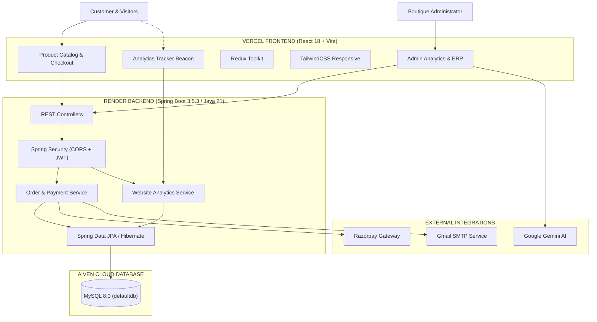

<div align="center">

<a href="#">
  
</a>

<br/>

<h1>AGVIA</h1>

<h3>WOMEN'S WEAR BOUTIQUE</h3>

<p>
  <em>Where tradition meets modern elegance.</em>
</p>

<br/>

<p>
  <strong>Premium Fashion Commerce</strong>
  &nbsp;•&nbsp;
  <strong>Secure Payments</strong>
  &nbsp;•&nbsp;
  <strong>Modern Operations & Analytics</strong>
</p>

</div>

[](https://react.dev/)
[](https://www.java.com/)
[](https://spring.io/projects/spring-boot)
[](https://aiven.io/mysql)
[](https://render.com/)
[](https://vercel.com/)
[](https://razorpay.com/)
[](https://www.docker.com/)

<br/>

### ✦ Premium Fashion Commerce · Secure Payments · Modern Operations · Live Analytics

<p>
  <a href="#-experience">Experience</a> •
  <a href="#-features">Features</a> •
  <a href="#-architecture">Architecture</a> •
  <a href="#-analytics-engine">Analytics</a> •
  <a href="#-tech-stack">Tech Stack</a> •
  <a href="#-api">API</a> •
  <a href="#-security">Security</a> •
  <a href="#-setup">Setup</a> •
  <a href="#-deployment">Deployment</a>
</p>

</div>

---

## ✦ About AGVIA

**AGVIA** is a premium women's fashion e-commerce platform designed around Indian ethnic wear, contemporary fashion and occasion-based collections.

The platform combines:

- Elegant fashion discovery & occasion-based curated collections
- Secure authentication (Stateless JWT + Mobile OTP + BCrypt)
- Real-time cart synchronization & persistent guest-to-user migration
- Razorpay payment integration & Cash on Delivery (COD)
- Strict server-authoritative inventory reservation with pessimistic locking
- Real-time administrative operations, catalog management & coupon engine
- Privacy-conscious real-time **Website Analytics Engine**
- Mobile-first responsive experience with static bottom navigation and quick profile access

> **AGVIA is designed as an enterprise-grade commerce product — engineered for scale, reliability, and real-time observability.**

---

# ✦ Experience

<div align="center">

| Discover | Shop | Pay | Track & Analyze |
|:---:|:---:|:---:|:---:|
| ✦ Collections | 🛍️ Products | 🔐 Secure Checkout | 📦 Orders & Analytics |
| Curated fashion | Product discovery | Razorpay + COD | Real-time dashboards |

</div>

<br/>

### The customer journey

```text
                 ┌─────────────────────┐
                 │       AGVIA         │
                 │  Women's Boutique   │
                 └──────────┬──────────┘
                            │
                            ▼
                 ┌─────────────────────┐
                 │ Explore Collections │
                 └──────────┬──────────┘
                            │
                            ▼
                 ┌─────────────────────┐
                 │ Discover Products   │
                 └──────────┬──────────┘
                            │
                            ▼
                 ┌─────────────────────┐
                 │   Product Details   │
                 └──────────┬──────────┘
                            │
                            ▼
                 ┌─────────────────────┐
                 │     Add to Cart     │
                 └──────────┬──────────┘
                            │
                            ▼
                 ┌─────────────────────┐
                 │   Secure Checkout   │
                 └──────────┬──────────┘
                            │
                            ▼
                 ┌─────────────────────┐
                 │ Razorpay or COD     │
                 └──────────┬──────────┘
                            │
                            ▼
                 ┌─────────────────────┐
                 │  Order Confirmation │
                 └─────────────────────┘
```

---

# ✦ Architecture



---

# ✦ Website Analytics Engine

AGVIA features an integrated, privacy-first **Website Analytics Engine** built directly into the core platform:

```text
Visitor Navigation
       │
       ▼
Frontend Auto-Tracker (Beacon Hook)
       │  (Page Views, Sessions, Duration, Device, Referrer)
       ▼
POST /api/analytics/collect (Public Ingestion Endpoint)
       │
       ▼
AnalyticsEvent Entity (MySQL InnoDB)
       │  (Indexed by timestamp, event_type, session_id)
       ▼
Admin Analytics Controller (/api/admin/analytics/**)
       │
       ▼
Live Admin Dashboard
  ├── Real-time Active Visitors (Last 30 mins)
  ├── Total Page Views & Unique Sessions
  ├── Bounce Rate & Average Visit Duration
  ├── Hourly Traffic Histogram
  ├── Top Visited Pages & Products
  ├── Traffic Referrer Attribution
  └── Device Breakdown (Desktop, Mobile, Tablet)
```

### Analytics Endpoints:
- `POST /api/analytics/collect` — Non-blocking event ingestion (public)
- `GET  /api/admin/analytics/overview` — Key metric summary (KPI cards)
- `GET  /api/admin/analytics/top-pages` — Most viewed routes & pages
- `GET  /api/admin/analytics/referrers` — Traffic source breakdown
- `GET  /api/admin/analytics/device-breakdown` — Device & browser share
- `GET  /api/admin/analytics/hourly-traffic` — 24-hour traffic trend
- `GET  /api/admin/analytics/recent-events` — Live visitor event feed
- `GET  /api/admin/analytics/realtime` — Active visitor count & live pulse

---

# ✦ Tech Stack

<div align="center">

| Layer | Technology | Version | Purpose |
|---|---|---|---|
| **Frontend Framework** | React | 18.3.1 | Core component architecture |
| **Build Tooling** | Vite | 5.4.2 | Ultra-fast HMR and bundling |
| **Styling & Design** | TailwindCSS | 3.4.1 | Utility-first responsive design |
| **State Management** | Redux Toolkit | 2.2.7 | Global authentication & cart state |
| **Icons & Animation** | Lucide React / Framer Motion | Latest | Micro-animations and crisp vector icons |
| **HTTP Client** | Axios | 1.7.4 | Interceptors, retry policies, correlation |
| **Backend Framework** | Java / Spring Boot | 21 LTS / 3.5.3 | High-throughput REST API |
| **Security** | Spring Security 6 & JJWT | 0.12.6 | Stateless JWT authorization & BCrypt |
| **Database** | MySQL 8.0 (Aiven Cloud) | 8.0 | ACID transactional persistence |
| **Persistence** | Spring Data JPA / Hibernate | 6.6 | Optimized ORM with HikariCP pooling |
| **Hosting (Frontend)** | Vercel | Production | Global edge CDN |
| **Hosting (Backend)** | Render | Production | Cloud container runtime (`render.yaml`) |
| **Payment Gateway** | Razorpay SDK | 1.4.8 | Server-authoritative order & signature verification |
| **Email Service** | Spring Mail (Gmail SMTP) | Production | Automated order receipts & alerts |
| **AI Assistant** | Google Gemini API | 2.5-flash | Admin business intelligence assistant |

</div>

---

# ✦ Repository Structure

```text
AGVIA/
├── .github/
│   └── workflows/
│       └── ci.yml               # Automated CI build & Render auto-deploy
├── docs/
│   ├── assests/agvia-logo.png   # Brand assets
│   └── AGVIA_PRODUCTION_ENGINEERING_MASTER_REPORT.md
├── docker-compose.yml           # Local multi-container development stack
├── render.yaml                  # Render Infrastructure-as-Code blueprint
├── vercel.json                  # Vercel deployment routing & headers
├── .env.example                 # Master environment variable template
├── package.json                 # Monorepo build orchestrator
├── README.md                    # Project documentation
│
├── AGVIA - BACKEND/             # Java 21 Spring Boot Application
│   ├── pom.xml                  # Maven dependencies & build configuration
│   ├── Dockerfile               # Multi-stage production container build
│   └── src/main/
│       ├── java/com/ems/pragathisweets/
│       │   ├── controller/      # REST API endpoints & Admin controllers
│       │   ├── entity/          # JPA Entities (User, Order, Product, AnalyticsEvent...)
│       │   ├── repository/      # Spring Data JPA repositories & native SQL queries
│       │   ├── security/        # JWT filter, CORS, rate limiting & security rules
│       │   └── service/         # Business logic, payments, email, analytics
│       └── resources/
│           └── application.properties # Spring Boot configuration
│
└── AGVIA  - FRONTEND/           # React 18 + Vite SPA
    ├── package.json
    ├── vite.config.js
    ├── tailwind.config.js
    └── src/
        ├── components/          # Reusable UI components & Layouts
        ├── hooks/               # Custom hooks (useAnalyticsTracker, useAuth...)
        ├── pages/               # Customer storefront & Admin portal pages
        ├── services/            # Axios API clients
        └── store/               # Redux slices
```

---

# ✦ Environment Variables

Configure these variables in your deployment environments:

### Backend (Render Dashboard / `.env`)

| Variable | Recommended / Default Value | Purpose |
|---|---|---|
| `DB_HOST` | `mysql-20386652-agvia.a.aivencloud.com` | Aiven MySQL Host |
| `DB_PORT` | `14519` | Aiven MySQL Port |
| `DB_NAME` | `defaultdb` | MySQL Database Name |
| `DB_USERNAME` | `avnadmin` | MySQL Username |
| `DB_PASSWORD` | *(Set in Render)* | MySQL Password |
| `DB_URL` | `jdbc:mysql://${DB_HOST}:${DB_PORT}/${DB_NAME}?sslMode=REQUIRED&allowPublicKeyRetrieval=true&serverTimezone=UTC` | Full JDBC URL |
| `PORT` | `8080` | Server listening port |
| `JAVA_TOOL_OPTIONS` | `-Xmx512m` | Render free-tier memory limit |
| `JWT_SECRET` | *(256-bit Base64 String)* | Token signing secret |
| `JWT_EXPIRATION_MS` | `86400000` | 24 Hours in milliseconds |
| `CORS_ALLOWED_ORIGINS` | `https://agvia.vercel.app,https://agvia-ecommerce.vercel.app,http://localhost:5173` | Allowed frontend domains |
| `FRONTEND_URL` | `https://agvia-ecommerce.vercel.app` | Base frontend URL |
| `RAZORPAY_KEY_ID` | `rzp_test_TDnNEoRLz2m96G` | Razorpay Key ID |
| `RAZORPAY_KEY_SECRET` | *(Set in Render)* | Razorpay Secret |
| `MAIL_HOST` | `smtp.gmail.com` | SMTP Host |
| `MAIL_PORT` | `587` | SMTP Port |
| `MAIL_USERNAME` | `venkatbodduluri78@gmail.com` | SMTP User |
| `MAIL_PASSWORD` | *(Google App Password)* | Gmail App Password |
| `GEMINI_API_KEY` | *(Set in Render / .env)* | Gemini AI Assistant Key |

### Frontend (Vercel Dashboard / `.env`)

| Variable | Example Value | Purpose |
|---|---|---|
| `VITE_API_URL` | `https://agvia-backend-1-xq21.onrender.com/api` | Live Backend API |
| `VITE_RAZORPAY_KEY_ID` | `rzp_test_TDnNEoRLz2m96G` | Public Razorpay Key |
| `VITE_GEMINI_API_KEY` | *(Set in Vercel / .env)* | Client AI Assistant Key |

---

# ✦ Local Setup

### Prerequisites
- Java 21 JDK
- Node.js 18+ & npm
- Maven 3.8+ (or included wrappers)
- MySQL 8.0 (or Docker)

### 1. Clone Repository
```bash
git clone https://github.com/vc78/AGVIA-ECOMMERCE.git
cd AGVIA-ECOMMERCE
```

### 2. Backend Setup
```bash
cd "AGVIA - BACKEND"
# Run with Maven
mvn spring-boot:run
```
Backend will start on: `http://localhost:8080`  
Swagger UI: `http://localhost:8080/swagger-ui.html`

### 3. Frontend Setup
```bash
cd "AGVIA  - FRONTEND"
npm install
npm run dev
```
Frontend will start on: `http://localhost:5173`

### 4. Running via Docker Compose
To launch the entire stack locally with a dedicated MySQL database:
```bash
docker compose up -d --build
```

---

# ✦ Deployment Guide

### Backend: Render
1. Connect your GitHub repository to [Render](https://render.com).
2. Create a **Web Service** with:
   - **Root Directory:** `AGVIA - BACKEND`
   - **Runtime:** `Java`
   - **Build Command:** `mvn clean package -DskipTests -B`
   - **Start Command:** `java -jar target/pragathi-sweets-backend-*.jar`
   - **Health Check Path:** `/api/health`
3. Configure Environment Variables in Render dashboard as documented above.
4. Auto-deployments are managed via `render.yaml` and `.github/workflows/ci.yml`.

### Frontend: Vercel
1. Connect repository to [Vercel](https://vercel.com).
2. Set **Root Directory** to `AGVIA  - FRONTEND`.
3. Set **Framework Preset** to `Vite`.
4. Configure `VITE_API_URL` pointing to your Render backend URL.
5. Deployments are triggered automatically on every push to `main`.

---

<div align="center">

## ✦ AGVIA
### Women's Wear Boutique
**Where tradition meets modern elegance.**

<br/>

`React 18` · `Spring Boot 3` · `MySQL 8` · `Aiven Cloud` · `Razorpay` · `Render` · `Vercel`

<br/>

<sub>Built with attention to engineering excellence, security, performance, and customer experience.</sub>

</div>
